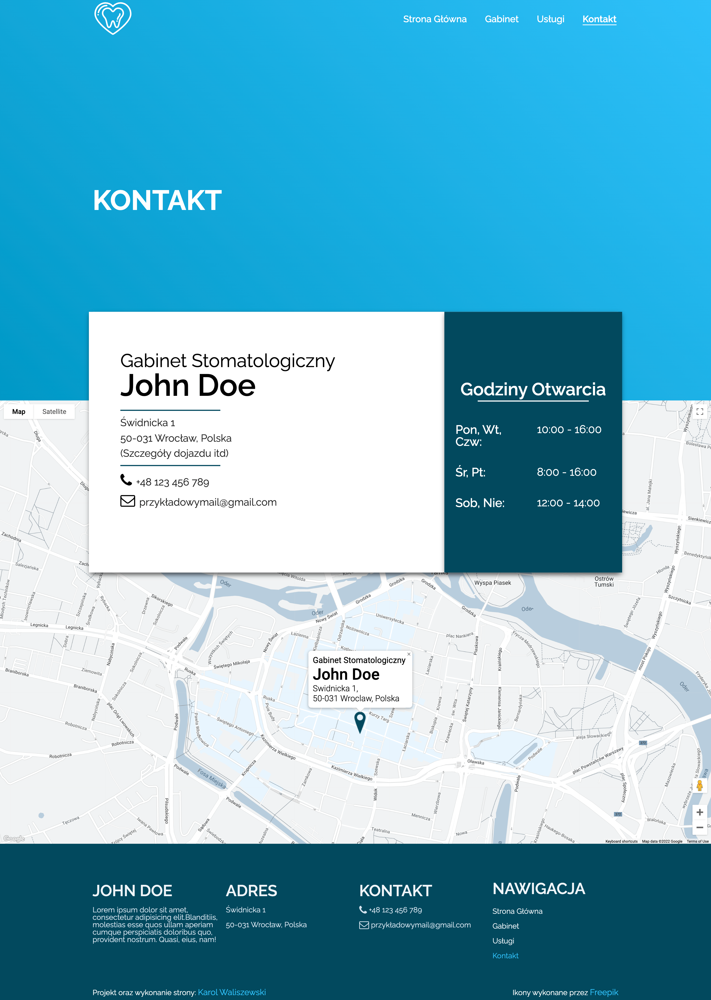

Projekt graficzny strony, jak i ona sama został wykonany od zera przeze mnie. W projekcie wykorzystałem połączenie HTML + SCSS + czysty JS. Postarałem się, aby napisany kod był na wysokim poziomie, dzięki czemu strona może zostać wyświetlona wyzej w wynikach wyszukiwania Google.

<!--  -->

