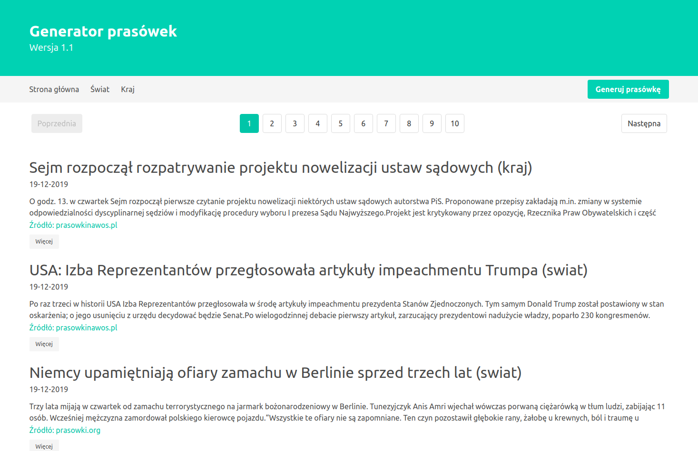

Prosty i szybki generator wiadomości czerpanych z róznych źródeł, które mogą być wykorzystane na lekcjach Wiedzy o Społeczeństwie w wersji online.

Projekt składa się z serwera opartego na Node.js z wykorzystaniem biblioteki express.js do obsługi żądań HTTP. Baza danych zawierająca wiadomości jest w MongoDB, a połączenie między bazą danych a serwerem oparte jest na bibliotece mongoose.js. Do skrapowania stron internetowych użyto axios + cheerio. Widoki są renderowane za pomocą handlebars.js, a stylizacja strony została zbudowana na bazie frameworku Bulma.

