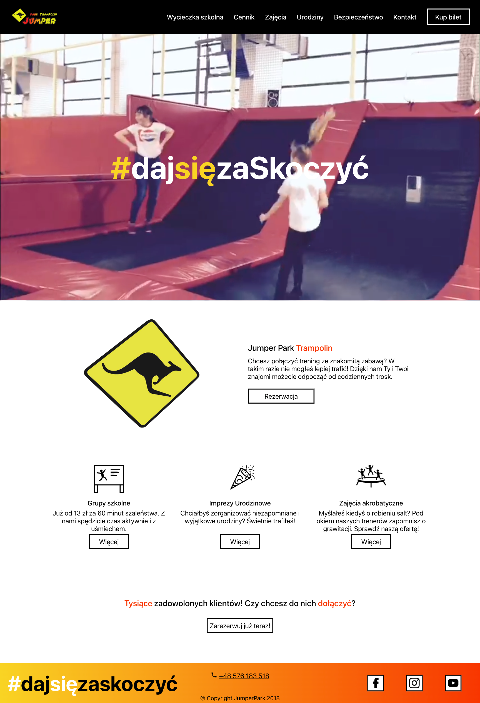
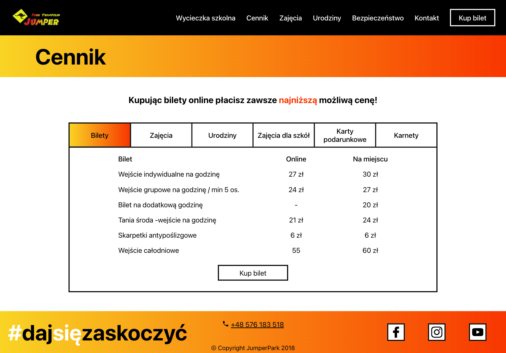
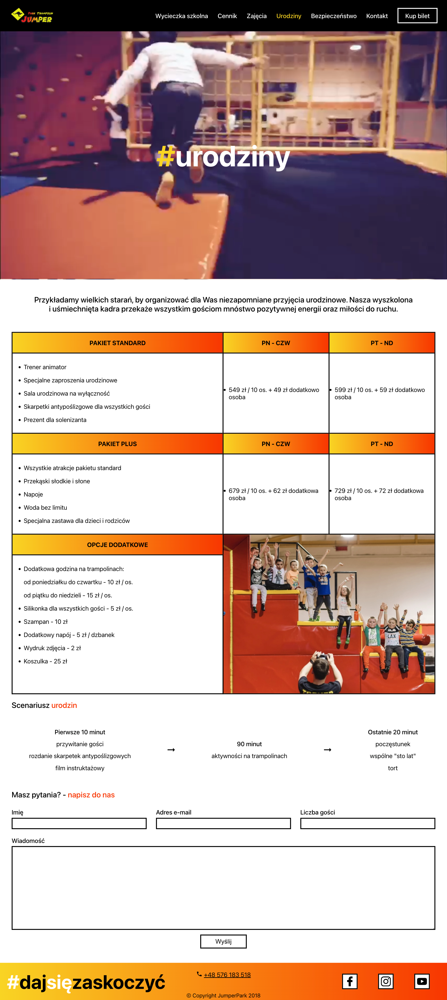

Komercyjny projekt, którym była strona stworzona dla parku trampolin znajdującego się w Białymstoku. Na początku stworzyłem projekt graficzny dla strony. Kolejnym etapem było zaprogramowanie wraz z przyjacielem stworzonego widoku. Strona została wykonana przy wykorzystaniu Reacta oraz wzbogacona o system zarządzania treścią, Flamelink.

