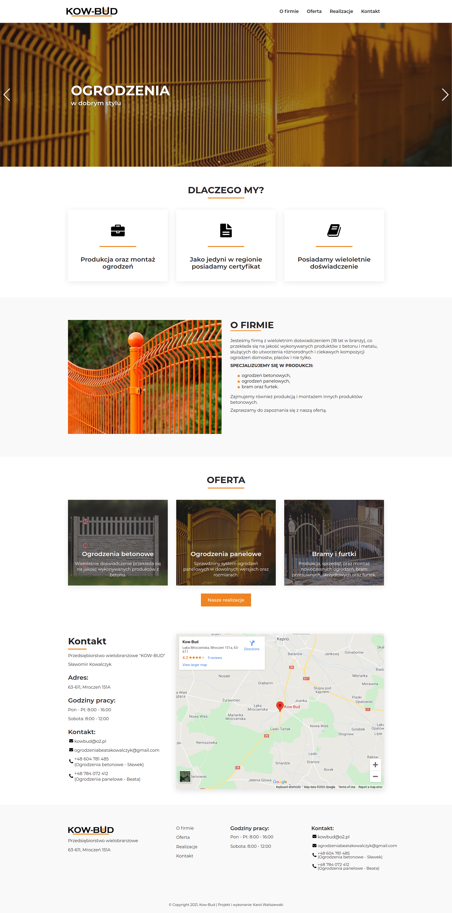

Komercyjnie zaprojektowana, oraz stworzona strona dla sprzedawcy ogrodzeń. Projekt graficzny został wykonany w pełni przeze mnie. Podczas procesu programowania skorzystałem z Gatsby'ego, którego możliwości SSG (Static Site Generator) pozwoliły na generację gotowych plików statycznych jak np HTML dla poszczególnych podstron, co przyczyniło się do szybkiego działania witryny. Do zarządzania treścią na stronie została wykorzystana platforma GraphCMS, natomiast do stylizacji komponentów na stronie został użyty zestaw narzędzi Styled-Components.

