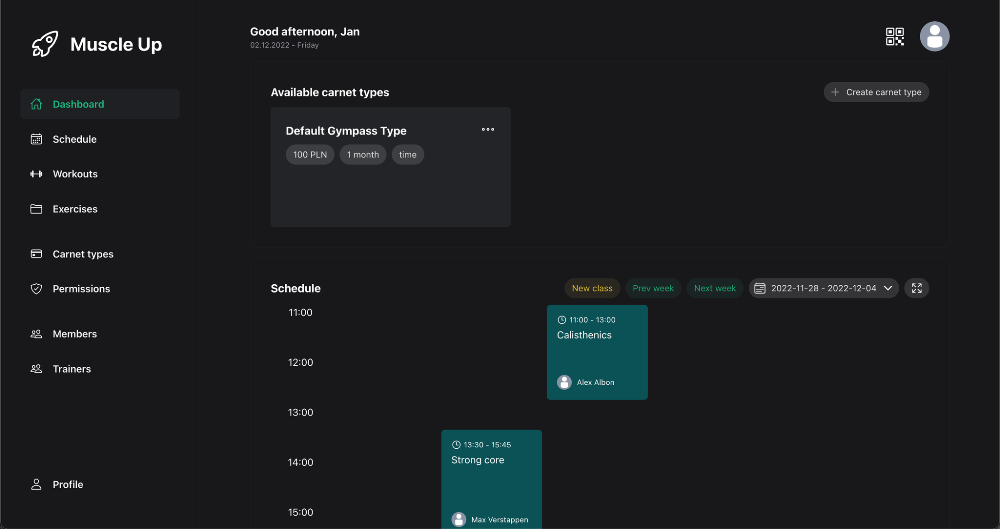
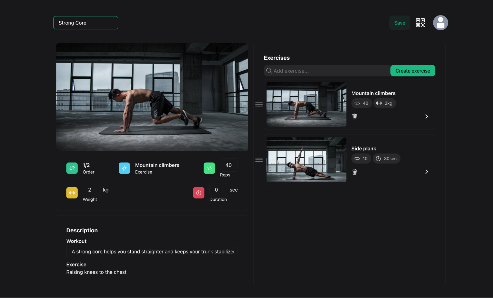
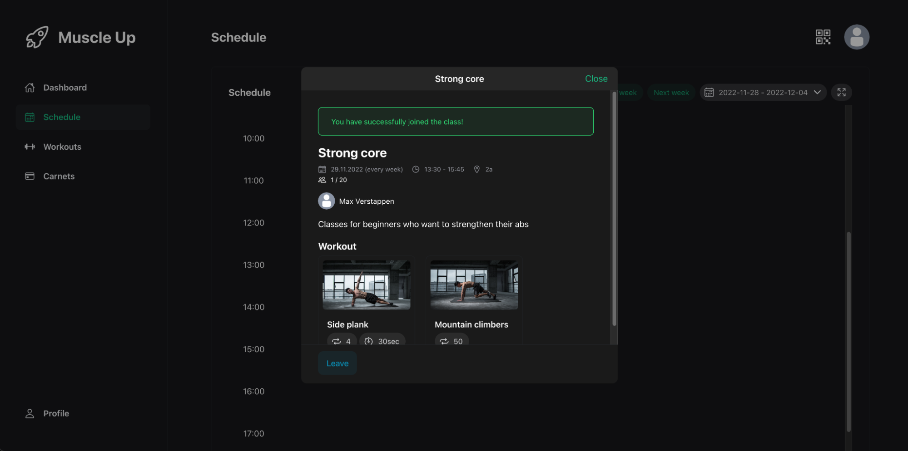
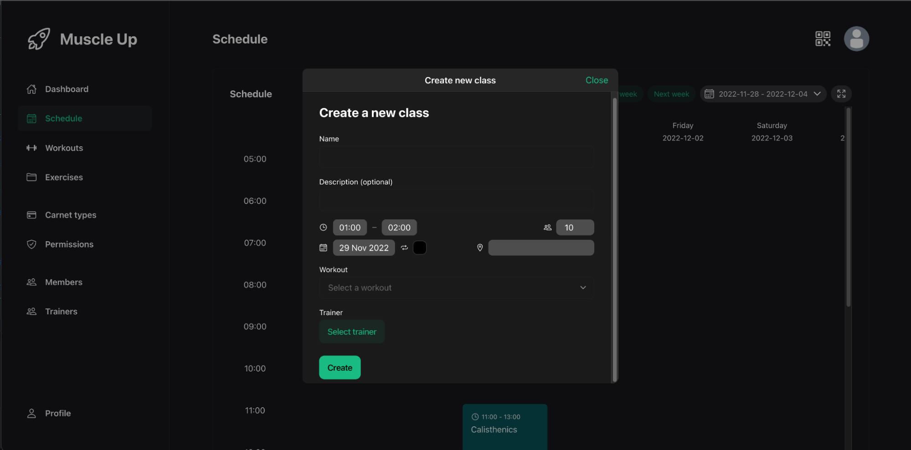
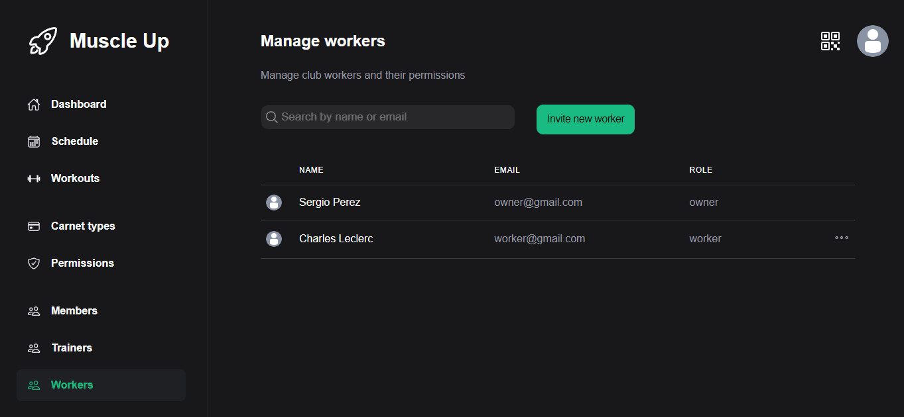
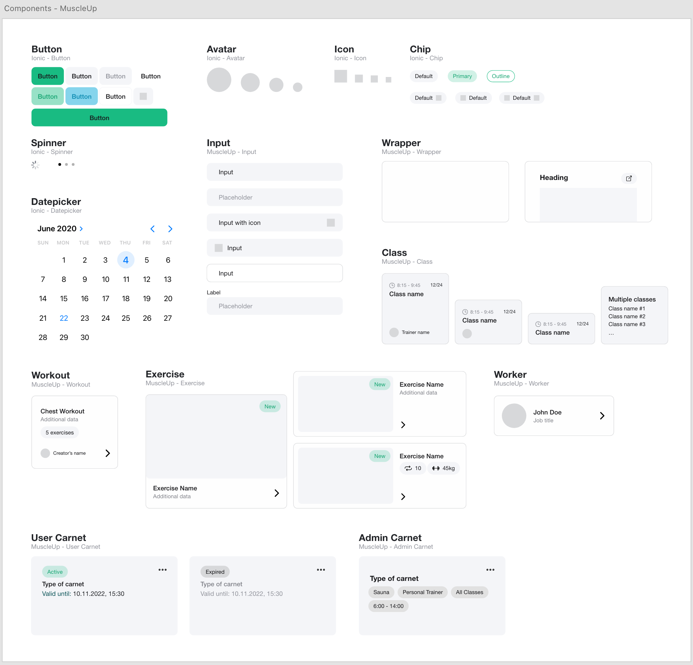
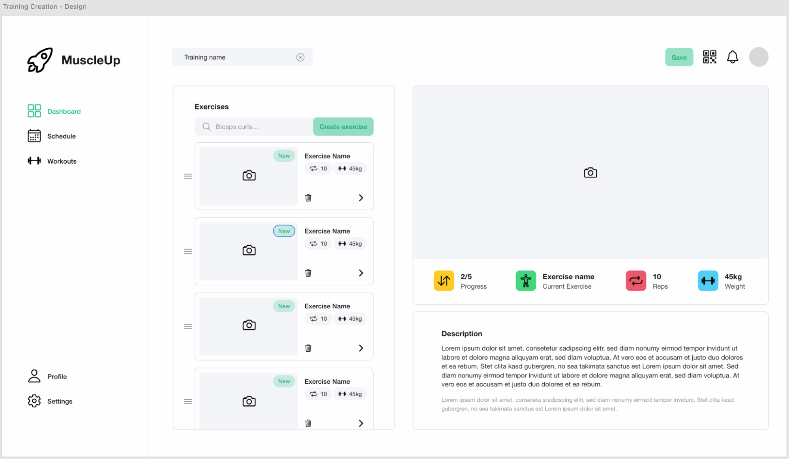

Projekt "MuscleUp" wykonany w ramach zespołowego przedsięwzięcia inżynierskiego. Nad projektem pracowaliśmy wspólnie w 4 osoby, dwójka moich przyjaciół była odpowiedzialna za część backendową, natomiast ja wraz z jeszcze jedną przyjacielem opiekowaliśmy się frontendem.
Aplikacja wspomaga zarządzanie klubami fitness. Umożliwia proste zarządzanie zarówno karnetami dostępnymi w klubie, klientami, ale również położony został duży nacisk na aspekt zajęć oraz zapisów na nie. Zainteresowany klient może przeglądać szczegóły treningu, który będzie w ramach interesujących go zajęć wykonywany, z dokładnością do pojedynczego ćwiczenia.

Aplikacja frontendowa została zbudowana w oparciu o React. Typescript zepewniał spójność typów, co znacznie ułatwiało pracę zespołową. Aby zadbać również o dobry UX użytkowników smarfonów zdecydowaliśmy się na dodanie rozwiązania Ionic. Do zarządzania stanem aplikacji został wykorzystany Redux, natomiast do zarządzania zapytaniami do API został wykorzystany React Query, który we współpracy z Zod, zapewniał wygodne i bezpieczne, z prespektywy typowania, rozwiązanie. Do stylizacji komponentów został wykorzystany TailwindCSS, a dokładniej jego pochodna WindiCSS, która została połączony z Windstitchem, w celu umożliwienia prostego tworzenia wariantów różnych komponentów. Aplikacja posiada zarówno tryb jasny, jak i ciemny. Do tworzenia dokumentacji komponentów został wykorzystany Storybook, a cały proces budowania projektu został zautomatyzowany dzięki Vite.

Dodatkowo w projekcie pełniłem rolę grafika, więc layouty oraz design system (bazujący na ionic) zostały wykonane przeze mnie.

