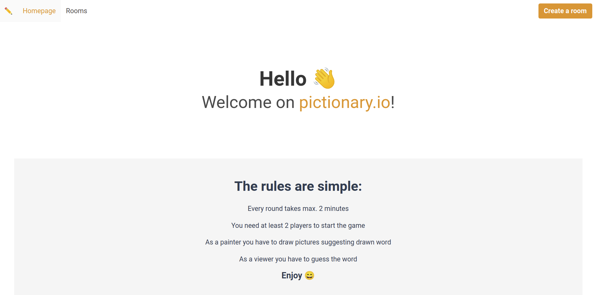
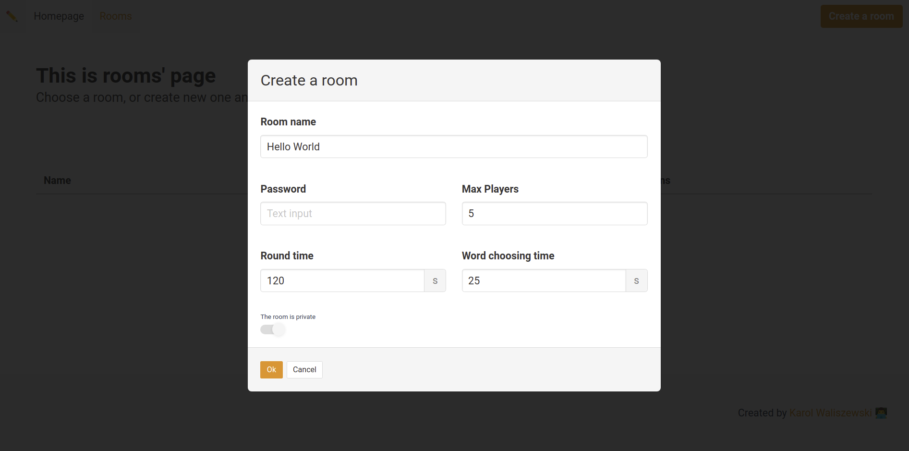
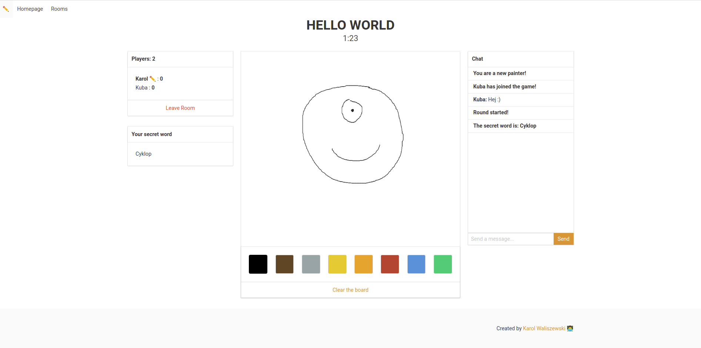

Gra na podstawie kalambur polegająca na rysowaniu obrazków sugerujących hasło, które otrzymał gracz rysujący. Pozostali gracze próbują odgadnąć hasło, aby zdobyć jak najwięcej punktów. Gra jest dostępna do zabawy ze znajomymi przez internet, wystarczy stworzyć pokój lub dołączyć do istniejącego.

Projekt składa się z dwóch głównych części: aplikacji klienckiej napisanej w języku Vue.js oraz serwera napisanego w node.js z wykorzystaniem biblioteki Socket.io.

Aplikacja kliencka zawiera interfejs użytkownika i zarządza rysowaniem oraz zgadywaniem haseł. W celu umożliwienia szybkiego i łatwego tworzenia interfejsu użytkownika w aplikacji klienckiej, projekt wykorzystuje framework CSS o nazwie Bulma. Bulma zapewnia gotowe komponenty i stylizacje, które ułatwiają tworzenie atrakcyjnego i responsywnego interfejsu. Aby gracze mogli komunikować się ze sobą, aplikacja korzysta z Socket.io do nawiązywania połączenia z serwerem.

Serwer natomiast odpowiada za utrzymanie sesji gry, przekazywanie informacji między graczami oraz zarządzanie logiką gry. W celu umożliwienia graczom dołączenia do istniejących pokoi lub tworzenia nowych, serwer zapewnia system zarządzania pokojami.

Dzięki połączeniu tych dwóch części, użytkownicy mogą korzystać z aplikacji przez internet, tworzyć pokoje lub dołączać do istniejących i bawić się wspólnie.

